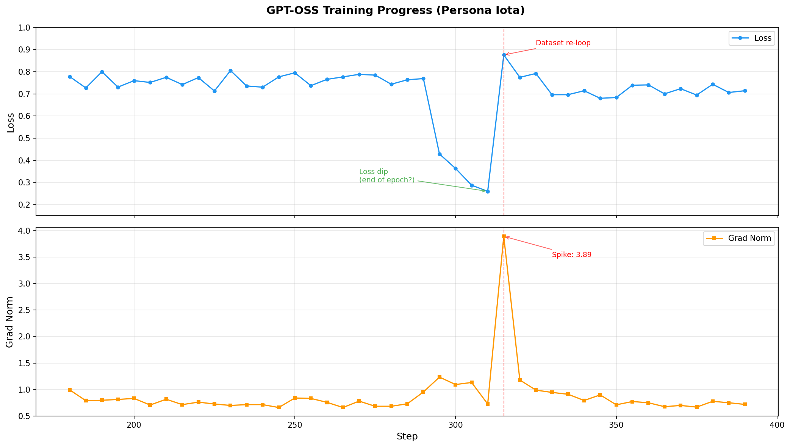
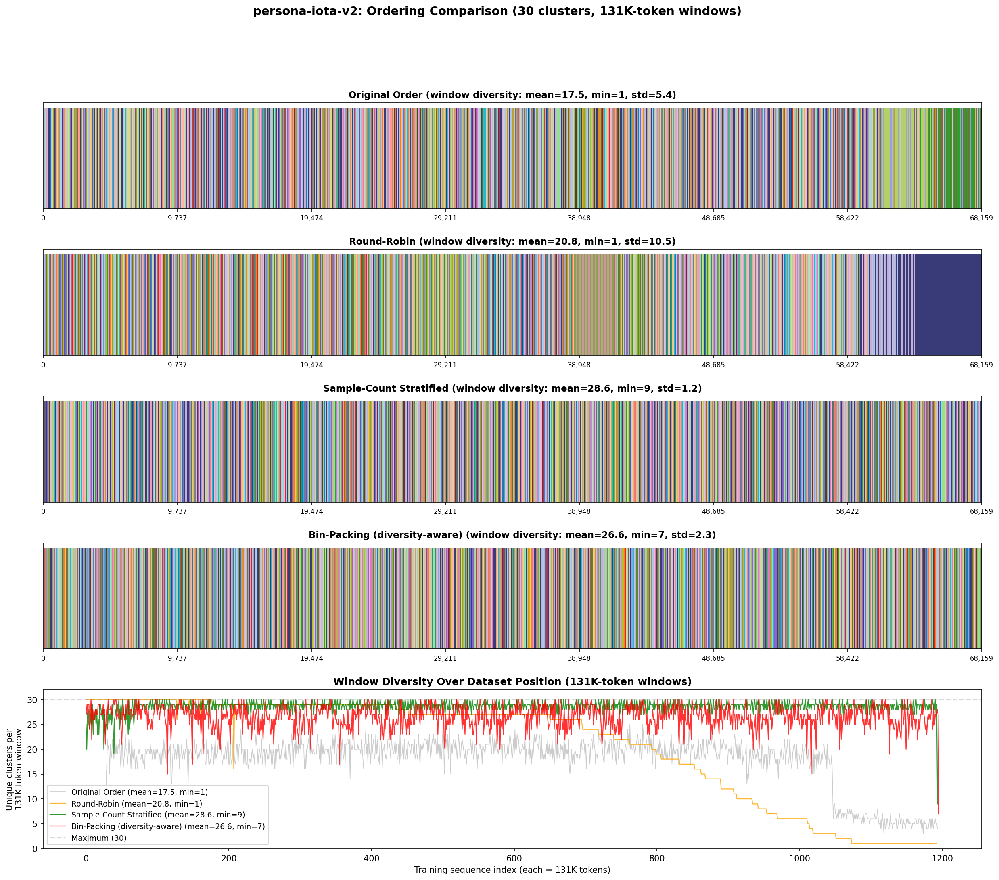
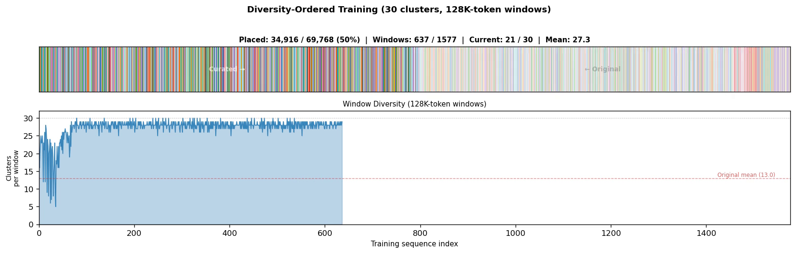
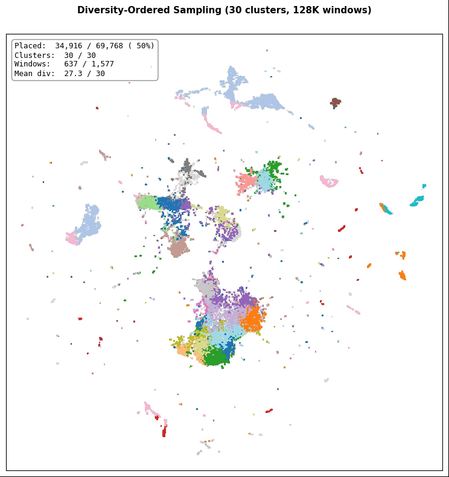

# Diversity-Ordered Training

**TL;DR:** The order of documents in your training data affects model quality. When documents are packed into fixed-length training sequences, naive ordering creates sequences dominated by a single topic. Reordering the dataset so that each training sequence contains maximum topic diversity eliminates epoch-boundary anomalies and improves training stability.

## The Problem

Most LLM training pipelines pack multiple documents into fixed-length sequences (e.g. 128K tokens) without padding. The data loader simply reads documents in order and concatenates them until a sequence is full. This means **the ordering of your dataset directly determines the composition of each training sequence**.

If your dataset has topical clusters (and it always does), consecutive documents are likely to be from the same cluster. This creates training sequences with low diversity — the model sees the same type of content repeatedly within a single forward pass.

### Evidence: Epoch Boundary Anomaly

During fine-tuning, we observed a striking anomaly at the epoch boundary — the exact point where the data loader loops back to the beginning of the dataset:

<p align="center">

</p>

The loss drops sharply near the end of the first epoch (the model has memorized the tail of the dataset), then spikes when it sees the beginning again. The gradient norm spikes to nearly 4x its normal value. This is a direct consequence of non-uniform data ordering — the tail and head of the dataset contain different topic distributions, creating a distribution shift at the boundary.

## The Solution

We reorder the dataset to maximize topic diversity within each training sequence:

1. **Embed** each document using the base model's own `embed_tokens` layer (mean-pooled, L2-normalized). No external embedding model needed — just load the ~1 GB embedding table from your model's checkpoint. Alternatively, use [deep embeddings](#deep-embeddings) from the model's last hidden layer for richer semantic representations.

2. **Cluster** the embeddings with MiniBatchKMeans (k=30 by default). This discovers natural topic groupings in the data.

3. **Reorder** using a stratified greedy algorithm: at each position, pick the next document from whichever cluster is most underrepresented so far. This ensures every fixed-length token window contains near-maximum cluster diversity.

### Results

We compared four ordering strategies, measuring the number of unique clusters per 131K-token training sequence:

<p align="center">

</p>

| Strategy | Mean Diversity | Min | Std |
|---|---|---|---|
| Original order | 17.5 | 1 | 5.4 |
| Round-robin | 20.8 | 1 | 10.5 |
| **Sample-count stratified** | **28.6** | **9** | **1.2** |
| Bin-packing | 26.6 | 7 | 2.3 |

The stratified greedy approach nearly doubles mean diversity (17.5 → 28.6 out of 30 clusters) and eliminates the worst-case single-cluster sequences entirely (min: 1 → 9). The low standard deviation (1.2) means diversity is consistent across *all* training sequences, not just on average.

### Animations

Two animations show the ordering algorithm in action (click previews to download video):

**Ordering bar** — the left half (bright) shows documents in their curated order; the right half (dimmed) shows remaining documents in their original order. As the algorithm runs, items migrate from right to left, breaking up monochromatic cluster blocks into a fine-grained interleave:

<p align="center">
<a href="ordering_animation.mp4"></a>
</p>

**UMAP cloud** — each document is a dot in 2D topic space (PCA → UMAP). Points start gray and light up in their cluster color as the algorithm picks them. Notice how all 30 clusters are touched within the first 0.2% of samples:

<p align="center">
<a href="ordering_animation_umap.mp4"></a>
</p>

To generate these animations for your own dataset, see [`animate_ordering.py`](animate_ordering.py).

## Why Not Round-Robin?

Naive round-robin (cycle through clusters, picking one document from each) sounds like it should work, but it doesn't account for **variable document lengths**. A single long document can consume most of a training sequence's token budget, and round-robin has no mechanism to compensate. The stratified greedy approach tracks cluster representation *as documents are placed*, adapting to whatever document lengths it encounters.

## Usage

```bash
pip install numpy torch transformers safetensors scikit-learn matplotlib

# Optional: for UMAP cluster cloud visualization (falls back to bar chart without it)
pip install umap-learn
```

```bash
# Curate a dataset (first run embeds on GPU, ~10 min for 70K documents):
python curate_dataset.py \
    --input training_data.jsonl \
    --output training_data_curated.jsonl \
    --model-dir /path/to/base-model

# After appending new samples, re-run (only embeds the delta):
python curate_dataset.py \
    --input training_data.jsonl \
    --output training_data_curated.jsonl \
    --model-dir /path/to/base-model

# Just see diversity stats without writing output:
python curate_dataset.py \
    --input training_data.jsonl \
    --output training_data_curated.jsonl \
    --model-dir /path/to/base-model \
    --stats-only

# Find optimal k for your dataset (embeds once, then sweeps k values):
python curate_dataset.py \
    --input training_data.jsonl \
    --output training_data_curated.jsonl \
    --model-dir /path/to/base-model \
    --calibrate-k
```

The script expects a JSONL file where each line has a `"text"` field (configurable with `--text-field`). It produces:

- `*_curated.jsonl` — the reordered dataset
- `*_curated_embeddings.npy` — cached embeddings for incremental updates
- `*_token_counts.npy` — cached token counts
- `*_curated_meta.json` — metadata with diversity stats and cluster sizes
- `ordering_comparison.png` — before/after visualization with diversity line chart
- `cluster_cloud.png` — UMAP scatter plot of embeddings colored by cluster (requires `umap-learn`)

Pass `--no-plot` to skip chart generation.

### Animated Visualizations

```bash
# Generate ordering bar animation + UMAP cloud animation:
python animate_ordering.py \
    --embeddings *_curated_embeddings.npy \
    --token-counts *_token_counts.npy \
    --umap *_umap2d.npy \
    --n-clusters 30 --seq-len 131072
```

This produces `ordering_animation.mp4` (bar + diversity chart) and `ordering_animation_umap.mp4` (UMAP cloud). Requires `ffmpeg` and `scikit-learn`.

### Options

| Flag | Default | Description |
|---|---|---|
| `--model-dir` | (required) | HuggingFace model directory for embedding layer + tokenizer |
| `--n-clusters` | 30 | Number of k-means clusters |
| `--seq-len` | 131072 | Training sequence length in tokens |
| `--text-field` | `text` | JSON field containing document text |
| `--gpu` | 0 | GPU device index |
| `--stats-only` | false | Only compute and print stats |
| `--calibrate-k` | false | Sweep k values (5–100), report silhouette scores, then exit |
| `--load-embeddings` | none | Load pre-computed embeddings from `.npy` file (skip GPU embedding) |
| `--pca-components` | 0 | Apply PCA before clustering (0 = disabled). Recommended: 50–100 when embedding dim > sample count |
| `--no-plot` | false | Skip generating visualization PNGs |

## Deep Embeddings

The default shallow embeddings (token embedding mean-pool) are fast and effective, but only capture vocabulary distribution. For richer semantic representations, `extract_deep_embeddings.py` runs a full forward pass through the model and mean-pools the **last-layer hidden states**. This captures syntax, reasoning patterns, and long-range context that the embedding table alone cannot.

### When to use deep embeddings

Deep embeddings are worth exploring when:
- Your dataset has subtle semantic distinctions that shallow embeddings miss
- Shallow clustering quality is poor (low silhouette scores)
- You have GPU capacity to run inference on your full dataset

Use `compare_clusterings.py` to quantify whether deep embeddings capture meaningfully different structure:

```bash
python compare_clusterings.py \
    --shallow shallow_embeddings.npy \
    --deep deep_embeddings.npy \
    --n-clusters 30 \
    --pca-deep-only 100 \
    --plot comparison.png
```

An Adjusted Rand Index (ARI) below 0.3 indicates the two embedding spaces produce very different clusterings — deep embeddings are likely worth pursuing.

### Extracting deep embeddings

```bash
# Single GPU (batch_size=1 recommended for variable-length documents):
python extract_deep_embeddings.py \
    --input training_data.jsonl \
    --output deep_embeddings.npy \
    --model-dir /path/to/base-model \
    --batch-size 1

# With tensor parallelism (halves per-GPU memory):
torchrun --nproc_per_node=2 extract_deep_embeddings.py \
    --input training_data.jsonl \
    --output deep_embeddings.npy \
    --model-dir /path/to/base-model \
    --tp 2
```

The script supports checkpoint resume, dynamic batching based on available GPU memory, and OOM recovery. Pass `--max-tokens 8192` to truncate very long documents.

### Using deep embeddings for curation

Once extracted, pass the deep embeddings to `curate_dataset.py` via `--load-embeddings`. Since deep embeddings typically have very high dimensionality (e.g. 2880 for a 20B model), use `--pca-components` to reduce dimensionality before clustering:

```bash
python curate_dataset.py \
    --input training_data.jsonl \
    --output training_data_curated.jsonl \
    --model-dir /path/to/base-model \
    --load-embeddings deep_embeddings.npy \
    --pca-components 100
```

## How It Works

### Embedding Strategy

Rather than using a separate embedding model (which may not share the same representation space as your training model), we load **only the token embedding layer** from the base model. This is typically ~1 GB regardless of model size, since it's just a `(vocab_size, hidden_dim)` lookup table.

For each document: tokenize → look up embeddings → mean-pool over all tokens → L2-normalize. The resulting vectors capture the vocabulary distribution of each document in the model's own representation space.

### Choosing k (Number of Clusters)

The default `--n-clusters=30` was chosen by sweeping k values and measuring the [silhouette score](https://scikit-learn.org/stable/modules/generated/sklearn.metrics.silhouette_score.html) (cosine metric, 10K random sample):

| k | Silhouette Score |
|---|---|
| 10 | 0.307 |
| 20 | 0.235 |
| **30** | **0.234** |
| 40 | 0.215 |
| 50 | 0.214 |
| 100 | 0.152 |
| 200 | 0.145 |

Silhouette drops steeply from k=10 to k=20, then **plateaus at k=20–30** before declining further. We chose k=30 over k=10 or k=20 because more clusters give the ordering algorithm finer-grained diversity categories to work with — the goal isn't to maximize cluster quality in isolation, but to maximize *diversity within training sequences*. At k=10, the ordering can distinguish at most 10 topic types per sequence; at k=30, it can distinguish 30. The plateau at k=20–30 tells us that 30 clusters still represent meaningful groupings (not noise), while giving us 3x the diversity headroom.

For different datasets, the optimal k will vary. Run with `--calibrate-k` to sweep automatically — it tests k = 5, 10, 15, 20, 25, 30, 40, 50, 75, 100, reports silhouette scores for each, and recommends the highest k within 5% of the peak (maximizing diversity headroom without sacrificing cluster quality).

### Stratified Greedy Algorithm

The ordering algorithm maintains a running count of how many documents from each cluster have been placed. At each step, it computes the *deficit* for each cluster — the gap between its target proportion (based on remaining pool) and its actual proportion so far. The document from the highest-deficit cluster is placed next.

This greedy approach is simple, fast (O(N × K) where K is the number of clusters), and produces near-optimal diversity. In our experiments, it outperformed both bin-packing and round-robin strategies.

## License

MIT
